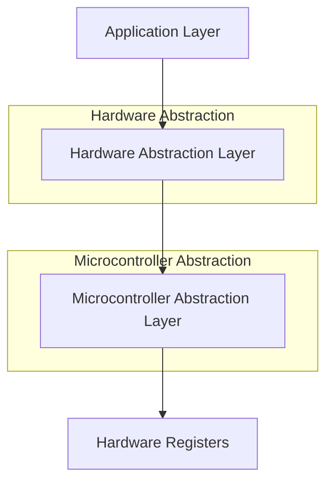

# 🚀 ATmega32 Drivers Repository

## 📝 Overview

Welcome to the **ATmega32 Drivers Repository**. This project provides a comprehensive collection of production-ready drivers for the ATmega32 microcontroller. It is structured into **MCAL (Microcontroller Abstraction Layer)** and **HAL (Hardware Abstraction Layer)** to ensure portability, modularity, and maintainability.

Each driver is designed with a focus on:
- **Clean Architecture**: Strict separation of concerns.
- **Configurability**: Compile-time and link-time configurations.
- **Efficiency**: Optimized for limited resource environments.

---

## 📑 Table of Contents

- [Overview](#-overview)
- [Architecture](#-architecture)
- [Drivers Summary Table](#-drivers-summary-table)
- [Driver Details](#-driver-details)
    - [MCAL Drivers](#mcal-drivers)
        - [ADC](#-adc-driver)
        - [DIO](#-dio-driver)
        - [EXTI](#-exti-driver)
        - [GIE](#-gie-driver)
        - [I2C](#-i2c-driver)
        - [SPI](#-spi-driver)
        - [Timers](#-timer-driver)
        - [USART](#-usart-driver)
        - [WDT](#-wdt-driver)
    - [HAL Drivers](#hal-drivers)
        - [BLUETOOTH](#-bluetooth-driver)
        - [CLCD](#-clcd-driver)
        - [EEPROM](#-eeprom-driver)
        - [I2C_LCD](#-i2c_lcd-driver)
        - [KEYPAD](#-keypad-driver)
        - [LDR](#-ldr-driver)
        - [LED](#-led-driver)
        - [LM35](#-lm35-driver)
        - [MPU6050](#-mpu6050-driver)
        - [NOKIA5110](#-nokia5110-driver)
        - [PB](#-pb-driver)
        - [RTC](#-rtc-driver)
        - [SERVO](#-servo-driver)

---

## 🏗️ Architecture

The repository follows a layered architecture pattern common in automotive (AUTOSAR-like) and industrial embedded systems.

### 🧩 Layers Breakdown

1.  **Application Layer (APP)**: Contains the main business logic. It interacts with the HAL to control peripherals.
2.  **Hardware Abstraction Layer (HAL)**: Abstracts external hardware (Sensors, Displays, Modules). It uses MCAL drivers to communicate with the microcontroller.
    - *Examples: LCD, Keypad, Servo, MPU6050*
3.  **Microcontroller Abstraction Layer (MCAL)**: Direct interface to the microcontroller internal registers. It provides a standard API to upper layers.
    - *Examples: DIO, UART, SPI, Timer, ADC*
4.  **Registers Layer**: Macros and definitions mapping to physical memory addresses.

---

## 📊 Drivers Summary Table

| Driver | Layer | Description | Key Features | Link |
| :--- | :---: | :--- | :--- | :---: |
| **ADC** | MCAL | Analog-to-Digital Converter | Voltage Ref options, Auto-trigger | [Open](./MCAL/ADC) |
| **DIO** | MCAL | Digital Input/Output | Pin direction, Pull-up control | [Open](./MCAL/DIO) |
| **EXTI** | MCAL | External Interrupts | Rising/Falling edge, Any change | [Open](./MCAL/EXTI) |
| **GIE** | MCAL | Global Interrupt Enable | Atomic access control | [Open](./MCAL/GIE) |
| **I2C** | MCAL | Two-Wire Interface | Master/Slave, Address matching | [Open](./MCAL/I2C) |
| **SPI** | MCAL | Serial Peripheral Interface | Master/Slave, Full-duplex | [Open](./MCAL/SPI) |
| **Timers** | MCAL | Timer/Counter 0,1,2 | PWM, CTC, Input Capture | [Open](./MCAL/Timers) |
| **USART** | MCAL | Serial Communication | Baud rate config, Interrupts | [Open](./MCAL/USART) |
| **WDT** | MCAL | Watchdog Timer | System Reset, Pivot Safety | [Open](./MCAL/WDT) |
| **BLUETOOTH**| HAL | HC-05/06 Module Control | Wireless Serial abstraction | [Open](./HAL/BLUETOOTH) |
| **CLCD** | HAL | Character LCD (16x2, 20x4) | 4/8-bit mode, Custom Chars | [Open](./HAL/CLCD) |
| **EEPROM** | HAL | External EEPROM (AT24C) | Byte Read/Write, Page Write | [Open](./HAL/EEPROM) |
| **I2C_LCD** | HAL | I2C-based LCD Adapter | PCF8574 Support, 2-wire LCD | [Open](./HAL/I2C_LCD) |
| **KEYPAD** | HAL | Matrix Keypad (4x4, 4x3) | Scanning algorithm | [Open](./HAL/KEYPAD) |
| **LDR** | HAL | Light Dependent Resistor | Voltage Divider mapping | [Open](./HAL/LDR) |
| **LED** | HAL | LED Abstraction | On/Off/Toggle logic | [Open](./HAL/LED) |
| **LM35** | HAL | Temperature Sensor | Celsius mapping (10mV/°C) | [Open](./HAL/LM35) |
| **MPU6050** | HAL | Accelerometer + Gyro | 6-Axis I2C motion tracking | [Open](./HAL/MPU6050) |
| **NOKIA5110**| HAL | Graphic LCD (PCD8544) | Bitmap drawing, SPI interface | [Open](./HAL/NOKIA5110) |
| **PB** | HAL | Push Button | Debouncing (optional), State | [Open](./HAL/PB) |
| **RTC** | HAL | Real Time Clock (DS1307)| I2C Timekeeping | [Open](./HAL/RTC) |
| **SERVO** | HAL | Servo Motor | Angle Control (0-180°) | [Open](./HAL/SERVO) |

---

## 📘 Driver Details

### MCAL Drivers

#### 🔵 ADC Driver
📁 **Folder**: [Open Folder](./MCAL/ADC)

**📝 Overview**
The Analog-to-Digital Converter (ADC) driver enables converting analog voltage signals into digital values. It supports configurable voltage references and prescalers.

**🔧 Features**
- 10-bit Resolution
- Selectable Voltage Reference (AVCC, Internal 2.56V, External AREF)
- Auto-triggering Support

**🧩 Public APIs**
- `ADC_init`: Initializes the ADC.
- `ADC_readChannel`: Reads the digital value (Blocking).

**⚙️ Configuration**
Configured via `ADC_Config_t` struct (Prescaler, VRef, AutoTrigger).

---

#### 🔵 DIO Driver
📁 **Folder**: [Open Folder](./MCAL/DIO)

**📝 Overview**
The Digital Input/Output (DIO) driver interface controls general purpose I/O pins.

**🔧 Features**
- Port/Pin Direction Control
- Read/Write Logic Levels
- Internal Pull-up Resistor Control

**🧩 Public APIs**
- `DIO_init`: Initialize pins based on config file.
- `DIO_writePin` / `DIO_readPin`: Pin manipulation.
- `DIO_writePort` / `DIO_readPort`: Port manipulation.
- `DIO_togglePin`: Toggle state.

**⚙️ Configuration**
Static configuration in `DIO_config.h` sets initial directions and values for all pins.

---

#### 🔵 EXTI Driver
📁 **Folder**: [Open Folder](./MCAL/EXTI)

**📝 Overview**
The External Interrupt (EXTI) driver handles INT0, INT1, and INT2 hardware interrupts.

**🔧 Features**
- Configurable Trigger Source (Rising, Falling, Low Level, Any Change)
- Callback Function Registration

**🧩 Public APIs**
- `EXTI_init`: Initialize a specific interrupt.
- `EXTI_enable` / `EXTI_disable`: Control interrupt mask.
- `EXTI_setCallback`: Register ISR handler.

---

#### 🔵 GIE Driver
📁 **Folder**: [Open Folder](./MCAL/GIE)

**📝 Overview**
Controls the Global Interrupt Enable (I-bit) in the Status Register.

**🔧 Features**
- Atomic operation support for critical sections.

**🧩 Public APIs**
- `GIE_enable`: Set I-bit.
- `GIE_disable`: Clear I-bit.

---

#### 🔵 I2C Driver
📁 **Folder**: [Open Folder](./MCAL/I2C)

**📝 Overview**
I2C (TWI) driver for communication with sensors and peripherals.

**🔧 Features**
- Master and Slave Modes
- Configurable Bit Rate and Prescaler

**🧩 Public APIs**
- `I2C_init`: Setup hardware.
- `I2C_start` / `I2C_stop`: Bus condition generation.
- `I2C_writeByte` / `I2C_readByte...`: Data transfer.
- `I2C_getStatus`: Check bus status.

---

#### 🔵 SPI Driver
📁 **Folder**: [Open Folder](./MCAL/SPI)

**📝 Overview**
Serial Peripheral Interface driver for high-speed synchronous communication.

**🔧 Features**
- Master/Slave operation.
- Configurable Clock Rate, Polarity, and Phase.

**🧩 Public APIs**
- `SPI_init`: Setup SPI.
- `SPI_transceive`: Simultaneous send and receive.

---

#### 🔵 Timer Driver
📁 **Folder**: [Open Folder](./MCAL/Timers)

**📝 Overview**
Comprehensive driver for Timer0, Timer1, and Timer2.

**🔧 Features**
- Modes: Normal, CTC, Fast PWM, Phase Correct PWM.
- Input Capture Unit (ICU) support.

**🧩 Public APIs**
- `TIMER_init`: Setup timer mode/prescaler.
- `TIMER_setCompareValue`: Update OCR.
- `TIMER_setDutyCycle`: Usage helper for PWM.
- `TIMER_icu_init` / `TIMER_icu_readInput`: Signal measurement.

---

#### 🔵 USART Driver
📁 **Folder**: [Open Folder](./MCAL/USART)

**📝 Overview**
Universal Synchronous/Asynchronous Receiver Transmitter for serial logging and comms.

**🔧 Features**
- Configurable Baud Rate.
- Parity, Stop Bit, Data Size settings.

**🧩 Public APIs**
- `USART_init`: Configure UART.
- `USART_send` / `USART_receive`: Byte transfer.
- `USART_sendStream`: String transmission.

---

#### 🔵 WDT Driver
📁 **Folder**: [Open Folder](./MCAL/WDT)

**📝 Overview**
Watchdog Timer driver for system reliability.

**🔧 Features**
- Multiple Timeout options (16ms to 2.1s).

**🧩 Public APIs**
- `WDT_enable` / `WDT_disable`: Control WDT.
- `WDT_setSleepTime`: Configure reset interval.

---

### HAL Drivers

#### 🔵 BLUETOOTH Driver
📁 **Folder**: [Open Folder](./HAL/BLUETOOTH)

**📝 Overview**
Abstraction for HC-05/HC-06 Bluetooth Modules via USART.

**🧩 Public APIs**
- `BLUETOOTH_init`: Wrapper for UART init.
- `BLUETOOTH_sendString` / `BLUETOOTH_receiveString`: Wireless text.

---

#### 🔵 CLCD Driver
📁 **Folder**: [Open Folder](./HAL/CLCD)

**📝 Overview**
Driver for HD44780-compatible Character LCDs.

**🔧 Features**
- 4-bit and 8-bit mode support.
- Custom Character generation.

**🧩 Public APIs**
- `CLCD_init`: Initialize display.
- `CLCD_SendString`: Print text.
- `CLCD_GoTOXY`: Move cursor.
- `CLCD_Clear`: Clear screen.

---

#### 🔵 EEPROM Driver
📁 **Folder**: [Open Folder](./HAL/EEPROM)

**📝 Overview**
Interface for external I2C EEPROMs (e.g., AT24C series).

**🧩 Public APIs**
- `EEPROM_init`: Setup I2C.
- `EEPROM_writeByte` / `EEPROM_readByte`: Memory access.

---

#### 🔵 I2C_LCD Driver
📁 **Folder**: [Open Folder](./HAL/I2C_LCD)

**📝 Overview**
Controls Character LCDs using an I2C Expander (PCF8574), saving GPIO pins.

**🧩 Public APIs**
- `I2C_LCD_init`: Setup LCD via I2C.
- `I2C_LCD_displayString`: Print text.
- `I2C_LCD_moveCursor`: Cursor control.

---

#### 🔵 KEYPAD Driver
📁 **Folder**: [Open Folder](./HAL/KEYPAD)

**📝 Overview**
Matrix Keypad scanner.

**🔧 Features**
- Row Scanning Algorithm.
- Supports flexible mapping via `KEYPAD_ARRAY`.

**🧩 Public APIs**
- `KEYPAD_init`: Setup GPIO.
- `KEYPAD_getPressedKey`: Blocking or Non-blocking scan.

---

#### 🔵 LDR Driver
📁 **Folder**: [Open Folder](./HAL/LDR)

**📝 Overview**
Light Dependent Resistor interface.

**🧩 Public APIs**
- `LDR_init`: Setup ADC channel.
- `LDR_getAnalogReading`: Raw value.
- `LDR_getDigitalReading`: Threshold based (if supported).

---

#### 🔵 LED Driver
📁 **Folder**: [Open Folder](./HAL/LED)

**📝 Overview**
Simple abstraction for LEDs.

**🧩 Public APIs**
- `LED_turnOn` / `LED_turnOff`: Control state.
- `LED_toggle`: Invert state.

---

#### 🔵 LM35 Driver
📁 **Folder**: [Open Folder](./HAL/LM35)

**📝 Overview**
LM35 Temperature Sensor driver. Output is 10mV per degree Celsius.

**🧩 Public APIs**
- `LM35_getTemperature`: Returns float value of temperature.

---

#### 🔵 MPU6050 Driver
📁 **Folder**: [Open Folder](./HAL/MPU6050)

**📝 Overview**
IMU Driver for MPU6050 (Accl + Gyro).

**🔧 Features**
- Adjustable Ranges (2G-16G, 250-2000DPS).

**🧩 Public APIs**
- `MPU6050_init`: Configure sensor.
- `MPU6050_readAll`: Get X,Y,Z for Accl and Gyro + Temp.

---

#### 🔵 NOKIA5110 Driver
📁 **Folder**: [Open Folder](./HAL/NOKIA5110)

**📝 Overview**
Driver for Nokia 5110 (PCD8544) Graphic LCD.

**🔧 Features**
- Bitmap Rendering.
- Contrast Control.

**🧩 Public APIs**
- `NOKIA5110_init`: Setup SPI/GPIOs.
- `NOKIA5110_sendString`: Draw text.
- `NOKIA5110_drawFullImage`: Render bitmap.

---

#### 🔵 PB Driver
📁 **Folder**: [Open Folder](./HAL/PB)

**📝 Overview**
Push Button input driver.

**🧩 Public APIs**
- `PB_init`: Setup as Input.
- `PB_read`: Get current state (Pressed/Released).

---

#### 🔵 RTC Driver
📁 **Folder**: [Open Folder](./HAL/RTC)

**📝 Overview**
Real-Time Clock (DS1307) driver.

**🧩 Public APIs**
- `RTC_init`: Start clock.
- `RTC_setTime` / `RTC_getTime`: HH:MM:SS handling.
- `RTC_setDate` / `RTC_getDate`: DD/MM/YYYY handling.

---

#### 🔵 SERVO Driver
📁 **Folder**: [Open Folder](./HAL/SERVO)

**📝 Overview**
Servo motor control using PWM.

**🧩 Public APIs**
- `SERVO_init`: Setup Timer PWM.
- `SERVO_setAngle`: Rotate to degree (0-180).

---

## 🏗️ Build & usage

The project is structured to be built with `avr-gcc` or opened in Atmel Studio / Microchip Studio.

1.  **Clone the repository**.
2.  **Navigate** to the project folder.
3.  **Include** the necessary MCAL and HAL headers in your `main.c`.
4.  **Configure** per-driver `_config.h` files if needed.
5.  **Compile** and upload to ATmega32.

---

## ✍️ Author & Usage

This project is created and maintained by **Abdelrahman Arafa**.

You are free to use, modify, and share these drivers. The goal is to promote open knowledge and support the embedded systems community.

Feel free to contact me anytime for help, questions, or collaboration.
